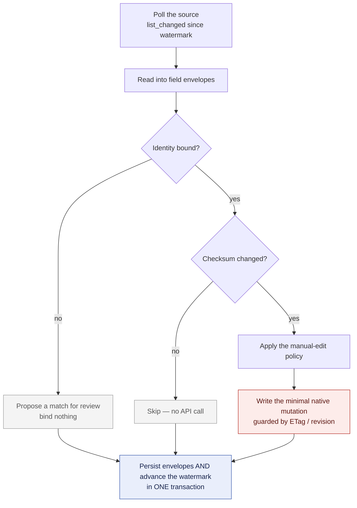
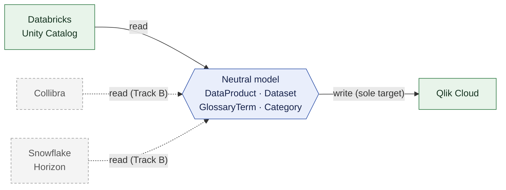

# QLabs Catalog Sync

Keeps **data-product metadata** consistent across data catalogs — Databricks, Qlik,
Snowflake, Collibra — so the same description, owner list and tags do not have to be
maintained by hand in each one.

> **Status: the engine works, and the console now runs in a browser.** The Databricks-to-Qlik
> sync is built, tested and tagged `v0.1.0-engine`. An operator can now sign in to the
> console and do the whole loop — register endpoints, define a sync pair, narrow its scope
> with rules and see the effect before applying it, review the planned writes, and read the
> run history — served by the same process on the same port as the API, `/healthz` and
> `/metrics`. What remains is packaging it into one container image and the operator
> documentation (WP14). No part of this has run against a live tenant. See
> [Current state](#current-state) for exactly what exists.

---

## What it will do

### The problem

One data product usually lives in several catalogs at once — the tables in Databricks
Unity Catalog, the governed product and glossary in Qlik Cloud, listings in Snowflake
Horizon, the business definitions in Collibra. Each catalog holds its own copy of the
description, the owners, the tags and the links between them, and each copy drifts as
soon as someone edits one of them. Keeping four catalogs in step by hand does not happen.

QLabs Catalog Sync reads that metadata from a source catalog, translates it through a
catalog-agnostic model, and writes only what actually differs into the target catalog —
on a schedule, repeatably, and without touching the data itself.

One finding shapes the whole design: Qlik Cloud publishes no webhooks or audit events for
items, datasets, data products or glossaries. There is nothing to subscribe to, so the
engine polls sources on a configured cadence and detects change by comparing checksums
rather than by listening for events.

### How the sync will work

Every sync pair runs the same cycle:

1. **Poll** the source for what changed since the last run (`list_changed`).
2. **Read** each changed object into neutral **field envelopes**.
3. **Resolve identity** — map the source object to its counterpart in the target through
   the IdentityMap.
4. **Diff** by checksum against the last-known envelope; unchanged fields produce no work.
5. **Apply the write policy** for values a human edited in the target.
6. **Write** the minimal native mutation the target supports, guarded by its own
   concurrency mechanism (ETag, revision, or none) as the connector declares it.
7. **Persist** the new envelopes and advance the watermark **in a single transaction**, so
   a crash mid-cycle commits nothing and the next run resumes from the last good point.
8. **Skip** anything whose checksum is unchanged.



Two properties fall out of that shape. A crash anywhere before the commit leaves both the
state and the watermark exactly as they were, so the next run resumes from the last good
point. And re-running over an unchanged source takes the *no* branch for every field — so
it is a genuine no-op: no API writes, no state churn.

Engine state is small and inspectable — an `identity_map`, per-pair `watermarks`, and the
last-known `field_envelopes` — on SQLite (WAL mode) by default, with the same schema on
PostgreSQL when more than one worker is needed.

### The neutral metadata model

Catalogs never map to each other directly. Everything passes through a neutral model, so
adding a catalog means writing one connector rather than N–1 translations.



Solid is what v1 ships: Databricks in, Qlik out. Collibra and Snowflake are written against
the same contract — adding them changes no engine code. Snowflake's read side is already
built (WP6); Collibra starts after v0.1.

Entities: **DataProduct**, **Dataset**, **GlossaryTerm**, **Category** — plus the
**Party**, **Tag** and **IdentityRef** value types reused across them.

Every synced field carries its own provenance:

```json
{
  "value": "<field value>",
  "sourceEndpoint": "qlik|databricks|snowflake|collibra",
  "sourceRevision": "<etag | revision counter | updatedAt>",
  "lastModifiedAt": "<RFC3339 from source>",
  "lastSyncedAt": "<RFC3339 engine time>",
  "checksum": "<hash of normalized value>"
}
```

That envelope is what makes field-level decisions possible: which catalog last set this
value, when, and whether it really changed or was merely rewritten identically.

Explicitly outside the model: data movement, lineage, data-quality and profiling metrics,
access policies and grants, and the query/metric semantic layers.

### Connectors and the capability manifest

A catalog is attached by installing a connector package. Registration is the entry point
in its `pyproject.toml` — there is no registry to edit and no engine code to change:

```toml
[project.entry-points."qlabs_catalog_sync.connectors"]
example = "qlabs_connector_example:ExampleConnector"
```

Each connector implements an async contract — `capabilities()` plus `setup`,
`healthcheck`, `list_changed`, `read`, `create`, `update` and `delete`. `list_changed`
returns both the changes and the next watermark, so envelopes and watermark can be
committed together.

`capabilities()` returns a **capability manifest** that describes, per entity and per
field, what this catalog can actually do:

- **field mode** — `rw`, `ro` or `na`
- **`partial_update`** — whether a field can be patched, or must be replaced wholesale
- **`allowed_update_paths`** — the exact set of paths the target's API accepts
- **`concurrency`** — `etag`, `revision` or `none`

The engine plans strictly from the manifest. It never writes a field a connector declares
`ro` or `na`, and it only sends `if-match` where the connector claims ETag support. A
dishonest manifest is therefore a correctness bug, not a documentation bug — which is why
the SDK ships a **conformance kit**. A connector is "certified" once it passes the
contract, round-trip, idempotency, HTTP-behavior and capability-honesty suites.

### What you will configure, and what you will run

Configuration is a set of **sync pairs**. A pair names its source endpoint, the target Qlik
space, which entity types to sync, the poll cadence, the policy for values edited by hand
in the target, and whether product activation is enabled. Credentials come from environment
variables or a secret manager; connectors never read the environment themselves, and
secrets are redacted from logs and never written to state.

**Which objects a pair syncs is a rule set, not a fixed list.** Rules are ordered, each one
includes or excludes by name pattern, source tag or owner, and the last rule that matches an
object decides — so "everything in this catalog except the staging schemas, but keep this one"
is expressible, and individual objects can be pinned in or out by hand. Rules apply at two
levels: which `catalog.schema` become data products, and which tables and views inside a
selected schema become that product's members.

The service runs as a single long-lived process — one container — exposing `/healthz` and
`/metrics` (Prometheus) and emitting structured JSON logs. Per-pair jobs run on their own
cadence with jitter, and a pair never overlaps itself.

**A browser console configures all of it.** Endpoints, pairs and selection rules live in the
service's own database rather than in environment variables, so they can be edited while it
runs and take effect without a restart. Credentials stay outside: an endpoint stores a *named
reference* to a secret — an environment variable, later a secret manager — and the console
shows only whether it resolves and whether the endpoint is healthy. Adding a catalog means
registering an instance of a connector already present in the image; nothing is downloaded or
installed from the browser. Every configuration change is recorded in an append-only log.

The console's point is the **preview**: change a rule and see exactly which objects fall in
and out of scope and which rule decided each one, then see the full planned write set — every
create, every field-level update, and every reference that failed to resolve — before a single
write happens. The same evaluator answers the preview and drives the real sync, so the two
cannot disagree. It also shows run history, the orphan and unresolved-reference reports, and
run-now, pause and resume controls.

There will also be a CLI, whose most important mode is **dry-run**: it computes the full
planned write set, emits it as a machine-readable plan file plus a human-readable log, and
applies zero mutations. (Command names are not fixed yet — see
[Current state](#current-state).)

### Scope of v1 — upstream only

v1 is deliberately the smallest safe version of the idea:

- **Upstream only.** Metadata flows from source catalogs into Qlik. There is no reverse
  flow.
- **Qlik is the only write target.** Exactly one write connector.
- **Source connectors are read-only.** No create, update or delete paths.
- **No two-way sync.** The only conflict handling is the manual-edit policy: source-wins
  overwrite by default, configurable to preserve local edits.
- **No access-control sync.** Access and authorization are entirely out of v1.
- **Owners are best-effort metadata**, correlated on email. This is not an identity system
  and must not become one.

The **MVP (Track A)** is one source and one target: Databricks Unity Catalog → Qlik Cloud.
A UC schema becomes one Qlik data product; its tables and views become that product's
datasets. **Track B** — Collibra, Snowflake and the Qlik glossary write path — is a separate
roadmap item (RM-05) on its own board, planned to start only after the MVP ships. The
Snowflake read connector has since been built ahead of that ordering; the rest of Track B
still sits as `blocked`.

Two safety properties hold for v1, by design:

- **The sync never creates Qlik datasets.** A product's dataset members are resolved
  against datasets that already exist in the target space; anything unresolved is left out
  of the payload and listed in the run report. The alternative — fabricating resources in
  the target — is worse than an incomplete product.
- **The sync never deletes in Qlik.** A source object that disappears is reported as an
  orphan, not removed. A misconfiguration is therefore recoverable by editing config
  rather than by restoring data.

### Beyond v1

Planned, not scheduled:

- **Two-way sync with conflict resolution** — reconciling edits in both directions without
  data loss. This is the project's core long-term promise.
- **A pluggable endpoint framework** — attaching a new catalog with no change to the
  engine at all.
- **Access observe-and-report** — reading authorization state from every catalog into a
  neutral, read-only access graph to report cross-catalog access and drift. Read-only by
  intent; syncing access is explicitly not the goal.

---

## Current state

**The Databricks-to-Qlik sync works end to end.** A Unity Catalog schema is read out of
Databricks, mapped through the neutral model, and written into a Qlik space by the
`qlabs-catalog-sync` command — dry-run first if you want to see the plan before anything
is written. It has not run against a live tenant: every test drives the real code against
mocked vendor APIs and hand-authored cassettes built from the published API documentation,
and the behaviours only a real tenant can confirm are listed in
[`docs/tenant-verification.md`](docs/tenant-verification.md) rather than assumed.

### Status at a glance

As of 2026-08-21 — RM-01 (the engine) is **complete**: 52 of 52 tasks. RM-06 (the console)
is **nearly complete**: WP10-WP13 are done and only WP14 (packaging, docs, the pilot)
remains. On Track B (RM-05), the Snowflake read connector (WP6) is complete. 2,795 Python
tests and 272 console tests passing.

| Work package | Scope | Done | Status |
|---|---|---|---|
| WP0 | Workspace, tooling, dependency pinning, CI | 6 / 6 | **Done** |
| WP1 | Connector SDK — model, contract, manifest, conformance kit | 10 / 10 | **Done** |
| WP2 | Engine — discovery, state store, sync loop, scheduler, CLI | 9 / 9 | **Done** |
| WP3 | Qlik write connector (sole writer) | 8 / 8 | **Done** |
| WP4 | Databricks read connector | 7 / 7 | **Done** |
| WP5 | Collibra read connector | 0 / 6 | Blocked (Track B, RM-05) |
| WP6 | Snowflake read connector | 6 / 6 | **Done** (Track B, RM-05) |
| WP7 | Identity map, field diff, owner correlation | 4 / 4 | **Done** |
| WP8 | Integration, end-to-end pilot, release readiness | 4 / 4 | **Done** |
| WP9 | Packaging, deployment, runbook, v0.1 tag | 4 / 4 | **Done** |
| WP10 | Configuration store, secret references, audit log | 4 / 4 | **Done** (console, RM-06) |
| WP11 | Selection rule engine, source tree, run history | 4 / 4 | **Done** (console, RM-06) |
| WP12 | REST API, authentication, generated client | 9 / 9 | **Done** (console, RM-06) |
| WP13 | Console SPA | 8 / 8 | **Done** (console, RM-06) |
| WP14 | One image, operator docs, console-driven pilot | 0 / 3 | Not started (console, RM-06) |

**v0.1 ships the engine and the console together.** WP0-WP4 and WP7-WP9 are the engine
(RM-01); WP10-WP14 are the console (RM-06); WP5 and WP6 are Track B (RM-05), whose plan
has them starting only after v0.1 is tagged. WP6 (Snowflake) was built ahead of that
ordering and is done; WP5 (Collibra), the Qlik glossary write path (T3.6) and both Track B
pilots (T8.2, T8.3) are still where the plan puts them, blocked behind the v0.1 tag.

Regenerate this picture at any time:

```bash
python3 planning/tools/agent-plan/ready_queue.py --all --roadmap RM-01
python3 planning/tools/agent-plan/ready_queue.py --all --roadmap RM-06
python3 planning/tools/agent-plan/ready_queue.py --all --roadmap RM-05
```

### What works today

Everything below is exercised by the test suite against mocked vendor APIs — no live
tenant has been involved.

- **The sync runs.** `qlabs-catalog-sync run` reads a Unity Catalog schema as a Qlik data
  product and its tables and views as datasets, writes the product into the configured
  Qlik space, and records what it did. `dry-run` computes the same plan, writes it as JSON
  and as a readable summary, and applies nothing.
- **Re-running changes nothing.** A second cycle over unchanged source data issues zero
  API writes — asserted against the target's recorded calls, not against a flag.
- **It never deletes and never activates.** A source object that disappears is reported as
  an orphan. The Qlik connector implements delete and the lifecycle actions so the contract
  is complete, but they refuse unless explicitly enabled, and nothing in v1 enables them.
- **It never invents a reference.** Dataset members resolve only against datasets already
  in the target space, and owner emails only against real Qlik users. Anything unresolved
  is left out of the payload and named in the run report.
- **Identity is confirmed, not guessed.** A first sync proposes matches into a review file
  and binds nothing until a human confirms; an ambiguous match is reported rather than
  tie-broken. Creating missing products is opt-in.
- **Writes are minimal and guarded.** Only fields that actually differ are sent, as
  replace-only JSON Patch against Qlik's closed eight-path enum, carrying the revision the
  change was computed against, with one re-read-and-retry on a concurrency conflict.
- **Tags come from Unity Catalog** through the Statement Execution API when a SQL warehouse
  is configured; without one the connector reports tags as unavailable rather than empty,
  so the sync leaves the target's tags alone instead of clearing them.
- **Snowflake reads too.** The Snowflake connector authenticates with a key-pair (no
  password anywhere), reads a schema as a data product and its tables and views as
  datasets, reads a Marketplace listing — including the composition of the share beneath
  it — as a data product in its own right, and brings across comments, owning roles, tags
  and Snowflake's own machine-generated privacy/semantic classifications. It finds what
  changed since the last run over Snowflake's account-usage views, which report on a delay
  of up to a few hours; the connector deliberately holds its bookmark back by that much and
  re-scans an overlap, so a change cannot fall between two runs. It is read-only and
  refuses every write. Nothing yet syncs Snowflake into Qlik end to end — that pilot is
  still Track B work.
- **All three working connectors are certified** against the SDK's conformance kit, which
  also fails a connector whose capability manifest lies about what it can do.
- **Operations:** structured JSON logs with sync context and no secrets, Prometheus metrics,
  `/healthz` and `/metrics`, a per-pair scheduler with jitter that never overlaps a cycle
  with itself, and automatic database migration on startup.
- **It ships as one container.** `serve` runs the service — one process, one job per pair —
  as a non-root user with state on a mounted volume. `SIGTERM` pauses the scheduler and lets
  a cycle already running finish rather than throwing away API budget already spent.
- **An operator runs the whole loop in a browser.** Sign in, register endpoints against the
  connectors this image contains, define a sync pair, narrow its scope with ordered rules
  and watch a live preview of exactly which objects fall in or out, review the planned
  writes, then run it and read the history — no config file, no restart. The API, the
  console, `/healthz` and `/metrics` are one process on one port, so there is no CORS and
  the console cannot drift from the engine it configures.
- **Rule order is the meaning, and the preview cannot lie.** Rules evaluate top to bottom
  and the last match decides; the console renders them in that order and every verdict it
  shows — included, excluded, or "cannot tell" — comes from the engine's own evaluator, the
  same code the real sync runs. A tag rule against a source that cannot report tags is
  reported as undetermined in its own right, never quietly folded into "excluded".
- **The console never handles a credential.** An endpoint binds a *named reference* to a
  secret, and secret-typed fields are stripped from the settings schema before it reaches
  the browser — so the form has no field to type a password into. The session cookie is
  `HttpOnly` and the SPA never reads it; nothing but the theme preference is persisted.
- **Configuration is authenticated and fails closed.** One administrator identity, a hashed
  credential from the environment, a CSRF token on every mutating request, and a refusal to
  start at all if no credential is configured.
- **Deploying it is documented.** [`docs/runbook.md`](docs/runbook.md) covers deploy,
  configure, dry-run, confirm identity, read an orphan report and diagnose a red healthcheck;
  [`deploy/`](deploy/) has per-tenant config and secret templates plus cadence defaults with
  the request-cost arithmetic behind them; and
  [`docs/capability-matrix.json`](docs/capability-matrix.json) is generated from the live
  connector manifests, with a `--check` mode that fails when it drifts.

### What does not exist yet

- **No live-tenant verification.** The connectors have never talked to a real Databricks
  workspace, Qlik tenant or Snowflake account. See
  [Known-unverified behavior](#known-unverified-behavior); the pre-production checklist in
  [`docs/tenant-verification.md`](docs/tenant-verification.md) covers the Qlik and
  Databricks assumptions item by item, and does not yet cover Snowflake's.
- **No Collibra connector.** The package exists as a placeholder that declares an entry
  point, so the engine reports it as unavailable at startup. It is Track B (RM-05) and
  starts after v0.1.
- **No Snowflake-to-Qlik sync yet.** The Snowflake connector reads, but no run has ever
  taken what it reads and written it into Qlik: that pilot (T8.3) is Track B and still
  blocked behind the v0.1 tag. Configuring a Snowflake endpoint through the console has
  likewise never been exercised.
- **No glossary sync.** Databricks has no glossary to source one from, so the Qlik glossary
  write path is Track B (decision D5).
- **No two-way sync and no access-control sync.** Both are out of v1 by design.
- **Not yet one container image.** The console is built separately (`pnpm -C console build`)
  and pointed at with `serve --console-assets`; folding the Node build stage into the image
  so one artifact ships both halves is WP14.
- **No operator documentation.** Console setup, the administrator credential, secret
  references and the selection rule model are not written up yet (WP14).
- **A dry run cannot report unresolved references.** The engine plans a write without
  calling the target, and dataset-member (D2) and owner (D3) resolution happens inside that
  call — so a dry run's unresolved-reference section is always empty, whatever the tenant
  contains. The dry-run screen says so rather than implying nothing was unresolved. An
  actual run reports them honestly. See `sync/loop.py`'s dry-run branches.

### Known-unverified behavior

The build runs without access to a live Databricks workspace, Qlik tenant or Snowflake
account, so connectors are written against mocked HTTP and hand-authored cassettes derived
from the API research. These points are documented assumptions until a real tenant
confirms them:

- whether the Qlik data-products `PATCH` endpoint honors `if-match`/ETag (undocumented —
  the writer sends it and tolerates its absence)
- the glossary-term patch path enum, the change-status request body, and the link payload
  shape
- whether `qri`/`secureQri` survive a space move and differ across tenants
- the exact custom-role permissions a Qlik sync service account needs
- Databricks rate-limit behavior at the chosen poll cadence
- how far behind Snowflake's account-usage views actually run on a given account — the
  change detector assumes the worse of the two figures Snowflake documents, because
  assuming too little loses a change while assuming too much only widens a re-scan
- whether Snowflake's tag reads really work without a running warehouse, as the capability
  manifest assumes
- which account-usage column carries a stable object id for each object kind, and whether
  a Snowflake key-pair token's issuer uses the bare account name or the hyphenated
  organization-account form

The Qlik and Databricks items are tracked as an explicit pre-production checklist, not
left implicit. The Snowflake ones are recorded in the connector's own code, marked
`TENANT-UNVERIFIED` at the point that depends on them, but are not on that checklist yet.

---

## Repository layout

A [uv](https://docs.astral.sh/uv/) workspace; every package uses a `src/` layout.

```
packages/
  qlabs-catalog-sync-sdk/       # the public contract, neutral model, helpers, conformance kit (WP1)
  qlabs-catalog-sync/           # the engine: discovery, sync loop, state store, scheduler (WP2, WP7)
  qlabs-connector-qlik/         # sole WRITE connector                                       (WP3)
  qlabs-connector-databricks/   # read-only source connector                                 (WP4)
  qlabs-connector-collibra/     # read-only source connector                (WP5, Track B, RM-05)
  qlabs-connector-snowflake/    # read-only source connector                (WP6, Track B, RM-05)
console/                        # the operator console SPA — Vite + React            (WP13)
planning/                       # design, research & plan — a separately-governed OKF bundle
```

**Dependency rule:** connectors depend only on the SDK (plus their vendor libraries); the
engine depends on the SDK and discovers connectors at runtime via the
`qlabs_catalog_sync.connectors` entry-point group. Nothing depends on a connector
directly.

## Quickstart

### Running it

Copy the templates in [`deploy/config/`](deploy/config/), fill in your two endpoints, and
look before you leap — `dry-run` writes a plan and changes nothing:

```bash
cp deploy/config/tenant.example.yaml config.yaml     # edit: hosts, space, selector patterns
cp deploy/config/tenant.env.example .env             # edit: the two client secrets

qlabs-catalog-sync dry-run --config config.yaml --plan-file plan.json
qlabs-catalog-sync run     --config config.yaml      # apply one cycle
qlabs-catalog-sync serve   --config config.yaml      # or run it as a service
```

A first sync against an empty Qlik space needs `--create-missing`; against a space that
already holds data products, use `identity-confirm` — nothing binds without you confirming
it. [`docs/runbook.md`](docs/runbook.md) is the operator guide, and
[`docs/tenant-verification.md`](docs/tenant-verification.md) is the checklist to run
**before** pointing this at production, because it has never run against a live tenant.

### Opening the console

The console is a separate build with its own toolchain (Node 22, pnpm 11), outside the uv
workspace. Build it, then point the service at the built assets:

```bash
pnpm -C console install --frozen-lockfile
pnpm -C console build                                # -> console/dist

uv run python scripts/make_admin_hash.py             # the administrator credential
# put the QLABS_CONSOLE_ADMIN__PASSWORD_HASH line it prints into .env

qlabs-catalog-sync serve --config config.yaml \
    --console-assets console/dist --port 8080
```

Then open `http://127.0.0.1:8080` and sign in. Without a credential configured the service
refuses to start, deliberately — it will not serve an unauthenticated console. Without
`--console-assets` the API, `/healthz` and `/metrics` still serve and `/` says the console
is not installed.

To just look at the console without a tenant, point `--config` at
[`deploy/config/local-console.yaml`](deploy/config/local-console.yaml) — it declares no
endpoints and no pairs, so nothing contacts Databricks or Qlik and the console comes up
empty, ready to be configured in the browser. In VS Code that is the **"UI: serve the
console and open a browser"** debug profile: it runs exactly that on port 8090 and opens a
browser when the service is up. It still needs `console/dist` built and the administrator
credential in `.env`.

`pnpm -C console dev` runs the Vite dev server instead, but the API is same-origin by
design (no CORS), so the dev server needs the service proxied behind it.

### Working on the code

Two gates, and a change is not done while either fails.

```bash
uv sync --all-packages              # install every workspace member + dev group
uv run ruff check packages scripts  # lint
uv run mypy                         # strict type-check
uv run pytest -q                    # tests
uv run python scripts/gen_openapi.py --check   # the committed API contract is current
```

```bash
pnpm -C console typecheck           # tsc --noEmit (vitest does NOT typecheck)
pnpm -C console lint
pnpm -C console test --run
pnpm -C console a11y                # axe-core over every *.a11y.test.tsx
```

## Working on it

The task board is machine-readable. To see everything ready to pick up right now (all
dependencies `done`):

```bash
python3 planning/tools/agent-plan/ready_queue.py --roadmap RM-01   # the engine
python3 planning/tools/agent-plan/ready_queue.py --roadmap RM-06   # the console
```

Then read [`AGENTS.md`](AGENTS.md) for how to claim and land a task, and
[`CLAUDE.md`](CLAUDE.md) for the dependency rule and scope guardrails.

## Design, research and the plan

Everything that justifies the design above lives under [`planning/`](planning/) — a
separately-governed Open Knowledge Format (OKF) bundle with its own tooling and
conformance rules. **Do not hand-edit it**; change it only through its own commands.

Start here:

- [`planning/Roadmap/completed/RM-01-one-way-sync-mvp/`](planning/Roadmap/completed/RM-01-one-way-sync-mvp/) —
  the v1 scope decision, the Databricks-to-Qlik mapping decisions, the implementation plan
  and the agent guide.
- [`planning/Roadmap/roadmap.md`](planning/Roadmap/roadmap.md) — RM-01 through RM-05.
- [`planning/Docu/`](planning/Docu/) — what has actually been built, one subject per part
  of the system. Empty until the first roadmap item completes.

Roadmap items are retired, not deleted: when one finishes, its delivery is recorded in
`planning/Docu/` and the item moves to `planning/Roadmap/completed/`. That is the only
sanctioned way to finish work — see the implementation lifecycle in
[`CLAUDE.md`](CLAUDE.md).

The API and design research behind it:

| Topic | Document |
|---|---|
| Neutral metadata model | [`RS-03`](planning/Research/RS-03-neutral-metadata-model/outputs/neutral-metadata-model-spec.md) |
| Architecture and tech stack | [`RS-07`](planning/Research/RS-07-architecture-techstack-references/outputs/architecture-and-techstack.md) |
| Connector plugin SDK | [`RS-08`](planning/Research/RS-08-connector-plugin-sdk/outputs/connector-sdk-spec.md) |
| Databricks Unity Catalog API | [`RS-01`](planning/Research/RS-01-databricks-catalog-api/outputs/databricks-catalog-api-reference.md) |
| Qlik Cloud catalog API | [`RS-02`](planning/Research/RS-02-qlik-catalog-api/outputs/qlik-catalog-api-reference.md) |
| Snowflake Horizon API | [`RS-05`](planning/Research/RS-05-snowflake-catalog-api/outputs/snowflake-catalog-api-reference.md) |
| Collibra API | [`RS-06`](planning/Research/RS-06-collibra-catalog-api/outputs/collibra-catalog-api-reference.md) |
| Access-control sync options | [`RS-09`](planning/Research/RS-09-access-control-sync/outputs/access-control-sync-options.md) |
